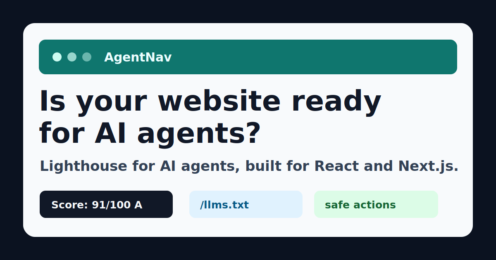

# AgentNav

**AgentNav is the agent-readiness layer for React and Next.js. It makes websites readable, navigable, actionable, and safer for AI agents.**

Lighthouse for AI agents. SEO for AI agents, built for React and Next.js. Make your website agent-readable in minutes.



Modern websites are optimized for people. AI agents can read and click like people, but that is brittle: buttons are ambiguous, forms hide risk, metadata is scattered, and critical business actions are not machine-readable.

AgentNav adds the missing layer:

- `/llms.txt`
- `/.well-known/agent.json`
- `/.well-known/actions.json`
- Schema.org JSON-LD
- `data-agent-*` DOM attributes
- form metadata
- safety and confirmation rules
- an agent-readiness score
- developer warnings and suggested fixes

## Try It In 2 Minutes

Install the React and Next.js packages:

```bash
pnpm add @agentnav/react @agentnav/next
```

Annotate one important action:

```tsx
import { AgentAction, AgentEntity, AgentField } from "@agentnav/react";

export function ListingCard() {
  return (
    <AgentEntity type="real_estate_unit" id="villa-a" name="Villa Type A">
      <h2>Villa Type A</h2>

      <AgentField name="price" value={12500000} currency="EGP">
        12,500,000 EGP
      </AgentField>

      <AgentAction
        id="book_viewing"
        type="book"
        risk="booking"
        requiresUserConfirmation
        description="Book a viewing for Villa Type A"
      >
        <button>Book Viewing</button>
      </AgentAction>
    </AgentEntity>
  );
}
```

Expose metadata routes in Next.js:

```ts
// app/llms.txt/route.ts
import config from "../../agentnav.config";
import { createLlmsTxtRoute } from "@agentnav/next";

export const GET = createLlmsTxtRoute(config);
```

Score the running site:

```bash
pnpm agentnav score http://localhost:3000/units
```

Example output:

```txt
Agent Readiness Score: 91/100 — A

High priority fixes:
1. No last-updated metadata found.
```

## Before And After

Before AgentNav, an AI agent only sees a generic button:

```html
<button>Book Viewing</button>
```

After AgentNav, the same action is explicit and safer:

```html
<button
  data-agent-action="book_viewing"
  data-agent-action-type="book"
  data-agent-risk="booking"
  data-agent-requires-confirmation="true"
>
  Book Viewing
</button>
```

Agents can now understand that this is a booking action and that a human must confirm before the appointment is submitted.

## Why AgentNav

AgentNav is for React and Next.js developers building SaaS, marketplaces, content sites, docs, ecommerce, real estate, and lead-generation websites that need to be understandable to AI agents.

Use it when your website has:

- important pages agents should understand
- entities such as products, services, articles, events, listings, or FAQs
- actions such as search, booking, contact, download, buy, or cancel
- forms that collect personal data
- safety rules around payment, booking, account changes, legal, medical, or destructive actions
- a need to measure agent-readiness over time

## Generated Files

`/llms.txt` is a readable guide for agents. It lists important pages, allowed tasks, confirmation rules, disallowed actions, and action summaries. `llms.txt` is an emerging convention, not a guarantee that every agent will consume it.

`/.well-known/agent.json` exposes site identity, policy, important pages, and related metadata file locations.

`/.well-known/actions.json` exposes stable actions from config, explicit React annotations, forms, and high-confidence scanned actions. Low-confidence inferred actions are not published as stable actions.

## Packages

- `@agentnav/core`: shared types, Zod schemas, generators, safety normalization, warnings, and scoring.
- `@agentnav/scanner`: browser runtime scanner for the current page.
- `@agentnav/react`: React provider and metadata annotation components.
- `@agentnav/next`: Next.js config and route helpers.
- `@agentnav/cli`: `init`, `scan`, `score`, and `build` commands.
- `examples/next-real-estate`: working Next.js real estate example.

## React Usage

Wrap the app with `AgentNavProvider` and annotate important entities, fields, actions, and forms.

```tsx
import { AgentNavProvider } from "@agentnav/react";

export function App({ children }: { children: React.ReactNode }) {
  return (
    <AgentNavProvider
      siteName="Hyde Park"
      sitePurpose="Real estate sales"
      domain="https://example.com"
      enableRuntimeScanner
      enableDevOverlay
    >
      {children}
    </AgentNavProvider>
  );
}
```

## Next.js Setup

Create `agentnav.config.ts`:

```ts
import { defineAgentNavConfig } from "@agentnav/next";

export default defineAgentNavConfig({
  siteName: "Hyde Park",
  domain: "https://example.com",
  purpose: "Real estate project website for browsing units and booking viewings",
  language: "en",
  importantPages: [
    {
      title: "Available Units",
      url: "/units",
      intent: "search_inventory",
      description: "Search and compare apartments, villas, and townhouses."
    }
  ],
  policies: {
    agentAllowed: ["read_content", "compare_options", "prepare_forms"],
    requiresConfirmation: ["submit_lead", "book_viewing", "make_payment"],
    disallowed: ["submit_payment_without_user_confirmation"]
  },
  actions: []
});
```

Add App Router route handlers:

```ts
// app/.well-known/agent.json/route.ts
import config from "../../../agentnav.config";
import { createAgentJsonRoute } from "@agentnav/next";

export const GET = createAgentJsonRoute(config);
```

```ts
// app/.well-known/actions.json/route.ts
import config from "../../../agentnav.config";
import { createActionsJsonRoute } from "@agentnav/next";

export const GET = createActionsJsonRoute(config);
```

## Runtime Scanner

`@agentnav/scanner` inspects the current browser page and returns an `AgentPage` object:

```ts
import { scanCurrentPage } from "@agentnav/scanner";

const page = scanCurrentPage();
console.log(page.score.score, page.entities, page.actions, page.forms);
```

It scans document metadata, canonical URL, navigation, JSON-LD, explicit `data-agent-*` attributes, actions, forms, labels, and basic heuristic entities. Invalid JSON-LD creates a warning instead of crashing.

## Readiness Score

Scores are out of 100:

- Page identity: 10
- Navigation clarity: 15
- Entity metadata: 15
- Action clarity: 20
- Form clarity: 15
- Structured data: 10
- Safety rules: 10
- Freshness: 5

Grades:

- `A`: 90-100
- `B`: 75-89
- `C`: 60-74
- `D`: 40-59
- `F`: 0-39

Warnings are actionable and include missing canonical URLs, invalid JSON-LD, generic duplicate action labels, unsafe sensitive actions, weak form labels, and missing freshness metadata.

## Safety Model

AgentNav never marks these actions as safe:

- spending money
- submitting personal data
- booking appointments
- canceling or deleting
- changing account settings
- submitting legal, medical, or financial information

Those actions are normalized to:

```json
{
  "safe": false,
  "requiresUserConfirmation": true
}
```

Explicit developer metadata has priority over inferred metadata. Heuristics can help warnings and local scans, but dangerous inferred actions are not published as safe stable actions.

## CLI

```bash
pnpm agentnav init
pnpm agentnav scan http://localhost:3000
pnpm agentnav score http://localhost:3000
pnpm agentnav build
```

`scan` opens a URL with Playwright and returns `AgentPage` JSON.

`score` prints a compact readiness summary.

`build` reads `agentnav.config.ts` and writes:

```txt
public/llms.txt
public/.well-known/agent.json
public/.well-known/actions.json
```

## Example App

Run the example:

```bash
pnpm --filter next-real-estate dev
```

Then inspect:

- `http://localhost:3000/llms.txt`
- `http://localhost:3000/.well-known/agent.json`
- `http://localhost:3000/.well-known/actions.json`
- `http://localhost:3000/units`
- `http://localhost:3000/book-viewing`

Score the running app:

```bash
pnpm agentnav score http://localhost:3000/units
```

## Development Commands

From the repository root:

```bash
pnpm install
pnpm build
pnpm test
pnpm lint
pnpm --filter next-real-estate dev
pnpm agentnav score http://localhost:3000/units
```

For Playwright e2e tests:

```bash
pnpm exec playwright install chromium
pnpm test:e2e
```

## Manual npm Publish

Publish packages in dependency order:

```bash
cd packages/core
npm publish --access public

cd ../scanner
npm publish --access public

cd ../react
npm publish --access public

cd ../next
npm publish --access public

cd ../cli
npm publish --access public
```

## Launch Materials

Launch copy, release notes, outreach templates, the demo script, and the social card live in `docs/marketing/`.

## Known Limitations

- MVP support is focused on React and Next.js.
- Heuristic entity and action inference is intentionally conservative.
- No dashboard, database, hosted analytics, browser extension, MCP server, or AI classifier is included yet.
- Static generation uses config and supplied page snapshots; it does not crawl a production site by itself.
- Freshness scoring currently depends on visible JSON-LD date metadata.

## Roadmap

1. Dashboard
2. Agent-readiness browser extension
3. MCP endpoint generator
4. OpenAPI integration
5. WordPress plugin
6. Shopify plugin
7. Rails gem
8. Agent analytics
9. Signed metadata
10. Agent payment policy support
11. Prompt-injection scanner
12. Agent journey testing
